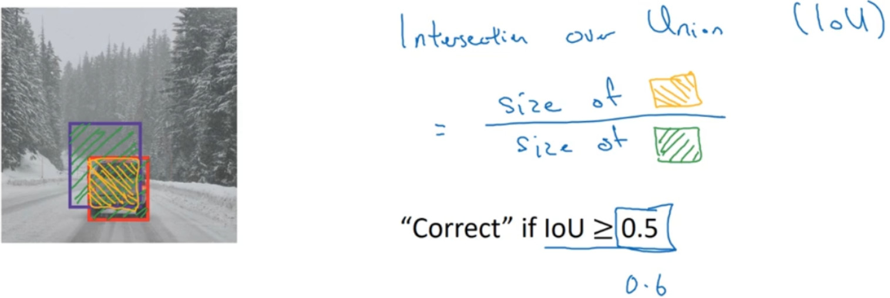

交并比（ $IoU$ ）函数做的是计算两个边界框交集和并集之比。两个边界框的并集是这个区域，就是属于包含两个边界框区域（绿色阴影表示区域），而交集就是这个比较小的区域（橙色阴影表示区域），那么交并比就是交集的大小，这个橙色阴影面积，然后除以绿色阴影的并集面积。

<!--more-->

一般约定，在计算机检测任务中，如果$IoU≥0.5$，就说检测正确，如果预测器和实际边界框完美重叠， $IoU$ 就是 $1$，因为交集就等于并集。但一般来说只要$IoU≥0.5$，那么结果是可以接受的，看起来还可以。一般约定，$IoU≥0.5$是阈值，用来判断预测的边界框是否正确。一般是这么约定，但如果你希望更严格一点，你可以将 $IoU$ 定得更高，比如说大于 $0.6$ 或者更大的数字，但 $IoU$ 越高，边界框越精确。

